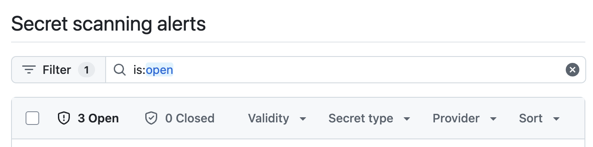
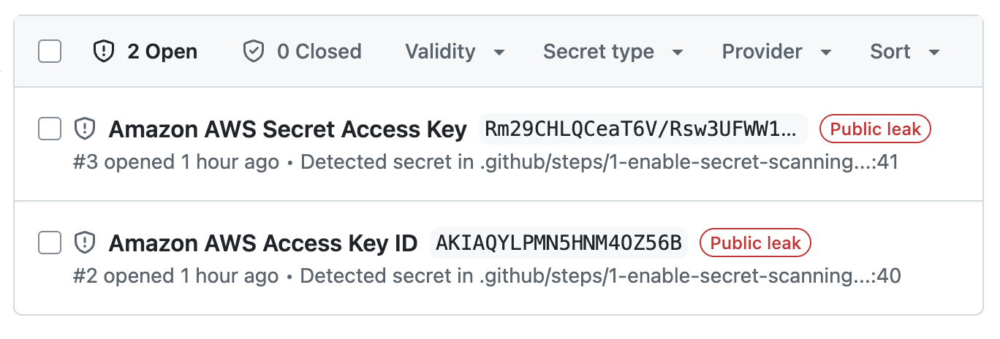
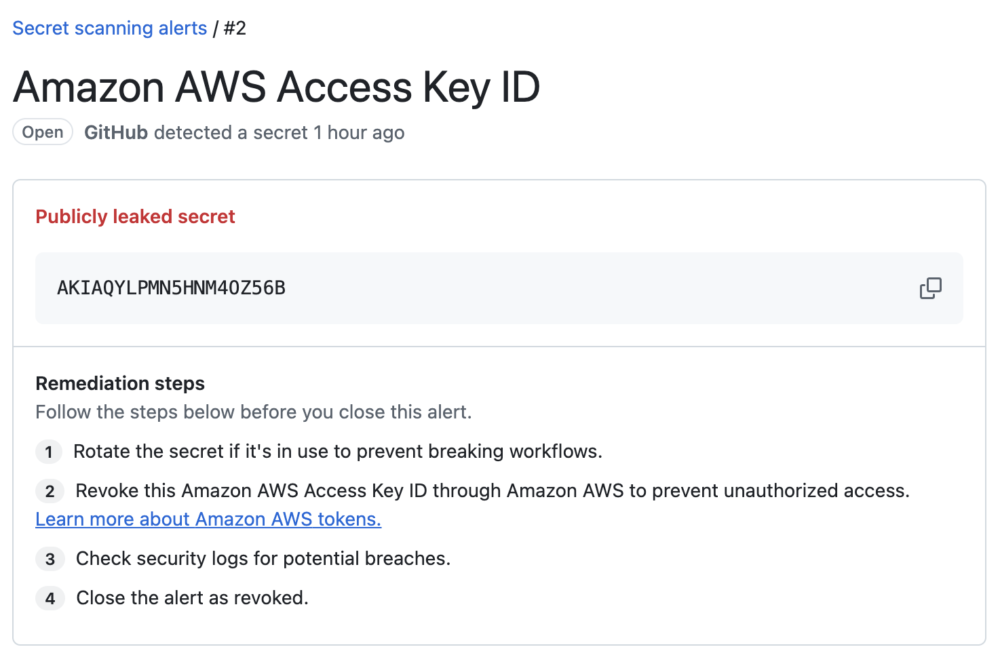
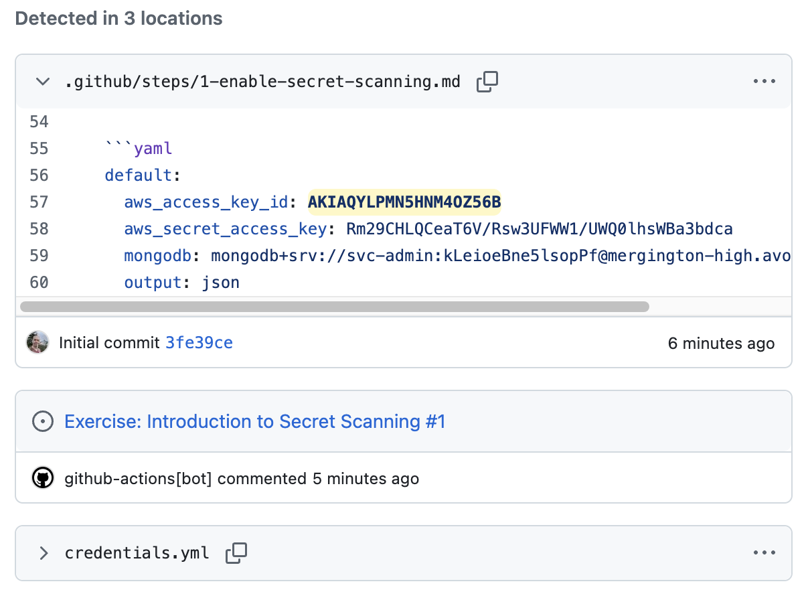
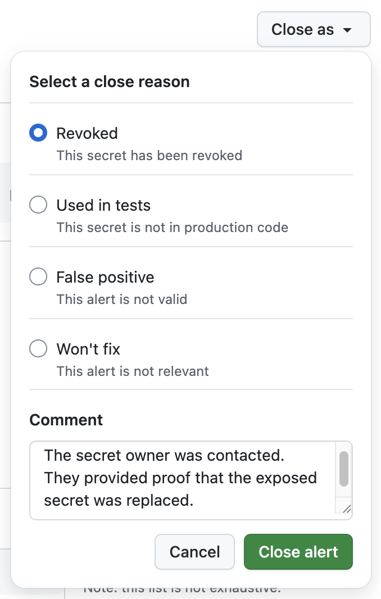
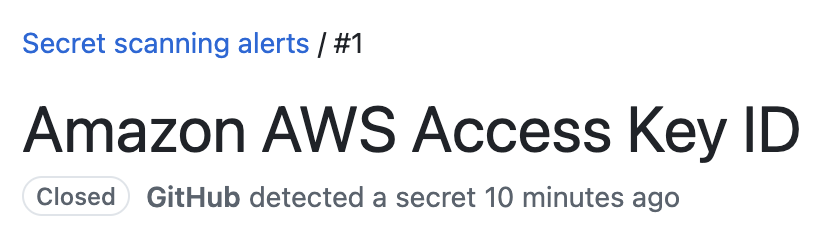
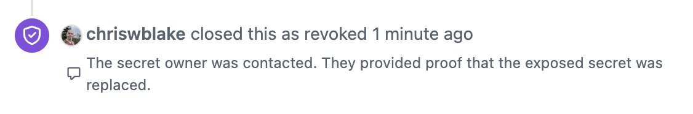

## Step 2: Review and close secret scanning alerts

In the last step, you enabled secret protection and committed a sensitive file to the repository. Now, let's review our open secret scanning alerts and close one.

### :keyboard: Activity: Triage secret scanning alerts

1. In the header of your repository, click the **Security** tab.

1. In the left navigation, select the **Secret scanning** option.

1. Notice various options in the header bar that can help triage our alerts.

   

1. Click the **Provider** dropdown and select `Amazon AWS` to filter the view. Notice only 2 of the 3 entries are listed now.

   

### :keyboard: Activity: Review a secret scanning alert

1. In the list of open alerts, select the `Amazon AWS Access Key ID` alert. This will open a details page with more information.

1. At the top of the page, we can quickly view the alert status, when it was opened, the exposed secret, and some remediation steps.

   

1. Scroll down slightly to the **Detected in X locations** area and you will see all the places where this secret was detected, including the `credentials.yml` file that you created. Notice that secret protection doesn't create duplicate alerts for the same secret found across multiple locations, for example in our learning issue.

   

### :keyboard: Activity: Close an alert

When secret protection finds a secret in your repository, the first thing you should do is **disable that secret with the provider**. You should assume it has been exposed.

> [!TIP]
> Some [supported secrets](https://docs.github.com/en/code-security/secret-scanning/introduction/supported-secret-scanning-patterns#default-patterns) are automatically sent to the provider when leaked.

1. Assuming you have taken remediation steps, we can update the status of our alert. In the top right, select the **Close as** dropdown.

   > 🚨 **Caution:** Do **NOT** close an open alert without performing remediation steps. This simply hides the problem and provides a false sense of security. It might even trigger additional alerts with your cybersecurity department. 🤦

1. Choose the `Revoked` option and enter a useful description of your remediation steps in the comment box (example below). Then choose **Close alert**.

   ```txt
   The secret owner was contacted. They provided proof that the exposed secret was replaced.
   ```

   > 💡 **Tip:** This is important so the audit log can later provide critical information if an investigation is required.

   


1. The alert status now displays `Closed` and the audit trail includes our explanation.

   

   

1. With at least one of our alerts resolved, let's add a comment to inform Mona we are done with this step, so she can share the next one.

   ```txt
   Hello @professortocat, I've resolved the security alert. What's next?
   ```
